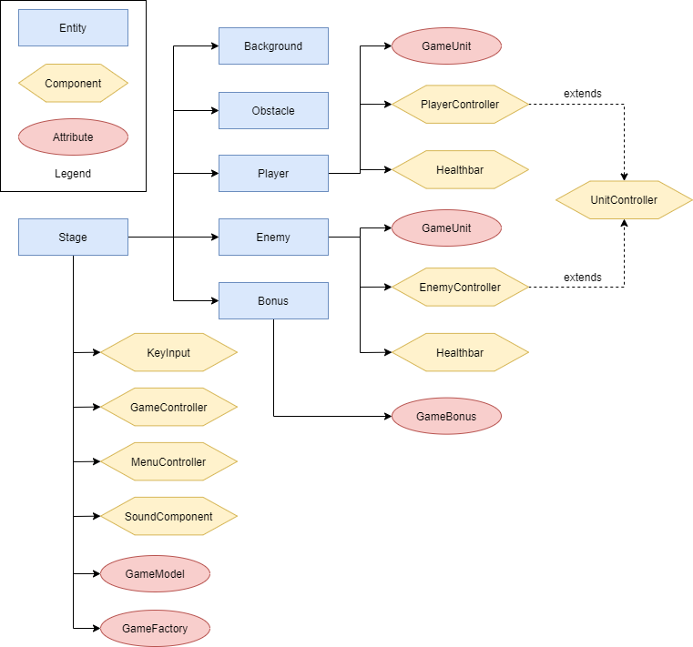

# Gladiator Arena

Author: Radomír Žemlička

Gladiator Arena is a classic deathmatch game where the goal is to survive and kill all the enemies with your muscles and loyal mighty axe. It's absolutely brutal! "Wait, just using my axe?" you might say. Well, that would be insane, wouldn't it? Don't worry, there will be lots of bonuses that spawn randomly on the game field which will help you gain more speed, strength and health points.

## How to run this beautiful monstrosity

It's simple.

1. clone this repository
2. run `npm install`
3. run `npm start`
4. open http://localhost:1234 in your browser
5. start the bloodshed

Or you can just load the live version here: http://gladiator-arena.razem.cz

## How to play and hopefully not die a painful death

When you load the actual game, you will see one blue figure. That's you! You will also see a few (depending on the level) red figures. Those are your enemies. They want to cut your freaking head off. You use Arrows to move and Spacebar to attack when you are near an enemy (red figures).

There are 6 levels total in the game. The number of the level also specifies the amount of enemies spawned.

As mentioned above, there will bonuses which randomly spawn on the game field.

* Red bonuses make you attack faster.
* Purple bonuses make your movement faster.
* Finally, green bonuses regenerate your health by 25 points (out of 100 total).

Also, every time a character is killed, a green bonus spawns at its location.

Note that the enemies are also able to pick up bonuses. Yay! They aren't just for you. So be sure to get to them faster than others.

## Implementation

The game was implemented using the PIXI library and the provided ECSA library. Sure, there are plenty of things that could have been done better. But overall the code is relatively clean and the gameplay (in my humble opinion) is pretty rad!

The following diagram illustrates the architecture of the game:

